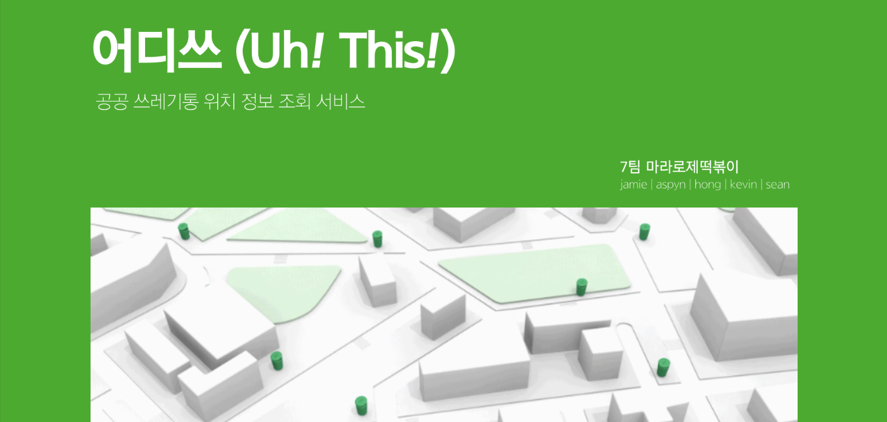
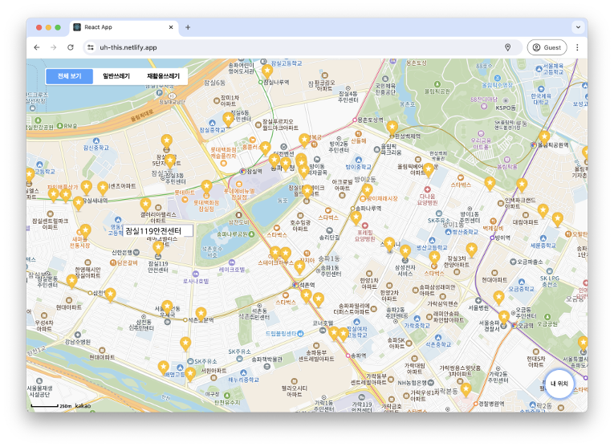
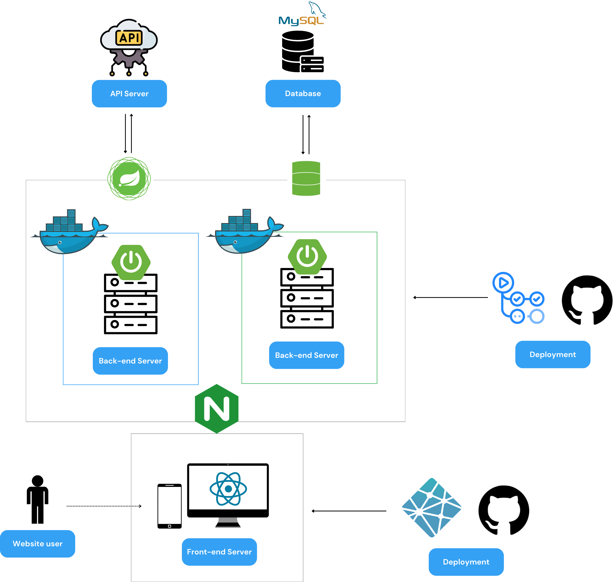

# 어디쓰 (Uh! This!)

> **공공 쓰레기통 위치 정보 조회 서비스**
>
> [🖥️ 배포 링크](https://uh-this.netlify.app/)

[📍 발표자료 바로가기](https://drive.google.com/file/d/1GjauYj1Vokdit1VNWkX4OAuExjXlLgrD/view?usp=sharing)

 

## ℹ️ 소개

"이거 다 먹고 어디다 버리지. 쓰레기통이 안 보이네."

"이거 플라스틱인데,, 재활용 쓰레기통 찾으러 다니기 귀찮으니까 그냥 일쓰로 버리자"

혹시 이런 상황 때문에 쓰레기 무단투기를 하거나 목격한 적이 있나요?

**어디쓰** 는 사용자의 현재 위치를 기반으로 가까운 쓰레기통 위치를 제공하는 서비스입니다.
이 서비스를 통해 쓰레기통을 쉽게 찾아 쓰레기를 올바르게 버릴 수 있습니다.

 

## 🗺️ 주요 기능

|               기능                |                            시연 영상                             |
| :-------------------------------: | :--------------------------------------------------------------: |
| 1. 사용자 주변 쓰레기통 위치 제공 |         |
|        2. 취급 쓰레기 분류        |  |
|        3. 지도 위치 초기화        |         |

 

## 🔗 시스템 구조도

 

## ⚙️ 기술 스택

### Front-end

  

 

### Back-end

    

 
 

## 🧑‍🧑‍🧒‍🧒 팀원 소개

7팀 `마라로제떡볶이`를 소개합니다. 😀

### Frontend (FE) Team

<table>
  <tr>
    <td align="center"> [팀장] <a href="https://github.com/yoouung">박재영 (jamie.park)</a></td>
    <td align="center"> <a href="https://github.com/JiHongKim98">김지홍 (hong.kim)</a></td>
  </tr>
</table>

### Backend (BE) Team

<table>
  <tr>
    <td align="center"> <a href="https://github.com/grulla79">김준호 (sean.kim)</a></td>
    <td align="center"> <a href="https://github.com/JiHongKim98">김지홍 (hong.kim)</a></td>
    <td align="center"> <a href="https://github.com/bysoyeon">박소연 (aspyn.park)</a></td>
    <td align="center"> <a href="https://github.com/sngbmYu">유승범 (kevin.yu)</a></td>
  </tr>
</table>

 

[📝 팀 회고 보러가기](https://goorm.notion.site/817ea21b1fc246c79404dbee12cae6b2?pvs=4)
